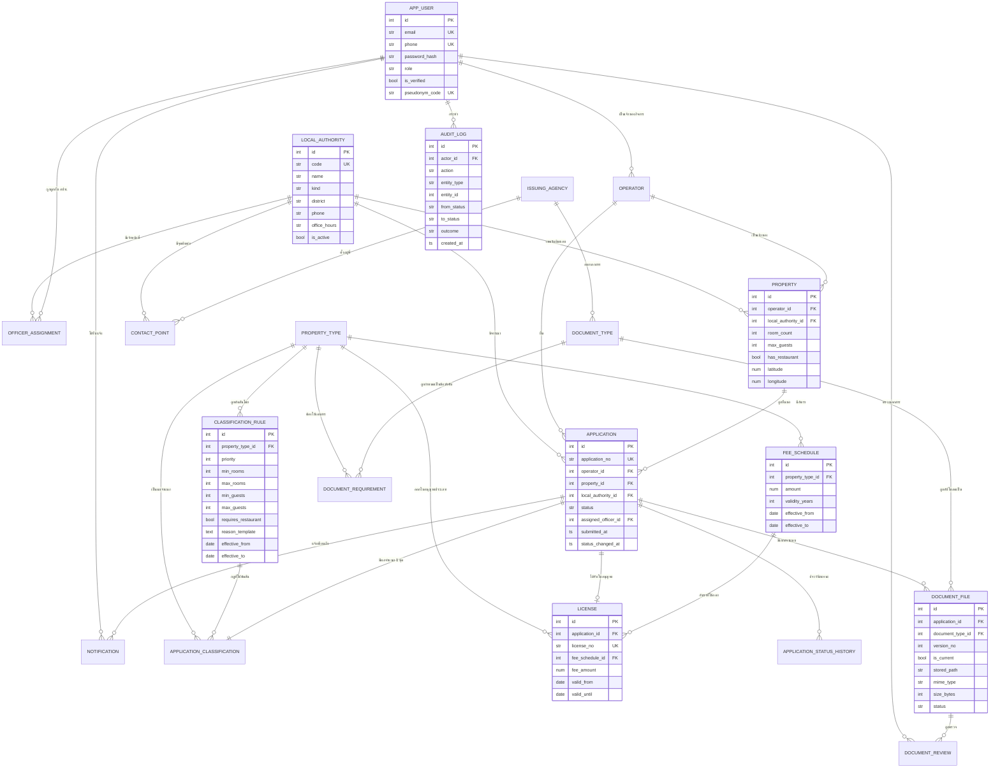

# แผนภาพ ER และโครงสร้างฐานข้อมูล

Deliverable ข้อ 2 — ER Diagram, สคริปต์ SQL และคำอธิบายการนอร์มัลไลเซชัน

- สคริปต์สร้างตารางฉบับเต็ม: [`schema.sql`](schema.sql) (สร้างจาก migration จริง ไม่ได้เขียนมือ)
- นิยามตารางในโค้ด: `backend/app/models/`
- migration: `backend/alembic/versions/be2a1464a844_initial_schema.py`

รวม **20 ตาราง** แบ่งเป็น 7 กลุ่มตามข้อ 8 ของโจทย์

---

## ER Diagram



---

## การตัดสินใจที่กรรมการน่าจะถาม

### 1. กฎจำแนกประเภทเก็บอย่างไรให้แก้ได้โดยไม่ต้องแก้โค้ด (US-09)

`classification_rule` เก็บเงื่อนไขเป็น**ช่วงตัวเลข** ไม่ใช่เก็บเป็นสูตรหรือโค้ด

| คอลัมน์ | ความหมาย |
|---|---|
| `priority` | กฎแรกที่เข้าเงื่อนไขครบชนะ เว้นเลขห่าง 10 ให้แทรกกฎใหม่ได้ |
| `min_rooms` / `max_rooms` | ช่วงจำนวนห้อง แบบ inclusive, `NULL` = ไม่จำกัดด้านนั้น |
| `min_guests` / `max_guests` | ช่วงจำนวนผู้เข้าพัก |
| `requires_restaurant` | `true` = ต้องมี, `false` = ต้องไม่มี, `NULL` = ไม่สนใจ |
| `reason_template` | ข้อความอธิบายเหตุผล (M2) มี placeholder `{rooms}` `{guests}` |
| `effective_from` / `effective_to` | ช่วงเวลามีผล — กฎเก่าไม่ถูกลบ |

โค้ดมีแต่ตัวเทียบ (`ClassificationRule.matches`) ไม่มีตัวเลขของกฎอยู่เลย
Super Admin เพิ่มประเภทที่พักใหม่ได้โดยเพิ่มแถวใน `property_type` + `classification_rule`

### 2. กับดัก T-02 และเหตุผลที่กฎประเภท 1/2 ไม่กำหนดขั้นต่ำของห้อง

ตารางข้อ 4 เขียนเงื่อนไขประเภท 1/2 ว่า "ห้องพักมากกว่า 8 ห้อง แต่ไม่เกิน 49"
ถ้าแปลตรงตัวเป็น `min_rooms = 9` จะเกิดช่องโหว่ทันที:

> **T-02** ที่พัก 8 ห้อง แต่รับผู้เข้าพักได้ 36 คน
> - ไม่เข้าเงื่อนไขยกเว้น เพราะคน 36 > 30
> - ไม่เข้าเงื่อนไขประเภท 1/2 ด้วย เพราะห้อง 8 ไม่ > 8
> - **ระบบตอบไม่ได้** ทั้งที่โจทย์เฉลยว่าต้อง "เข้าข่ายต้องขอใบอนุญาต"

การอ่านที่ถูกคือ **"ไม่เข้าข่ายโรงแรม" เป็นข้อยกเว้น** ที่ต้องเข้าเงื่อนไขครบทั้งสองข้อ
(ห้อง ≤ 8 **และ** คน ≤ 30) หลุดข้อใดข้อหนึ่ง = เป็นโรงแรม แล้วค่อยแยกประเภทตามห้องอาหาร

จึงตั้งกฎประเภท 1/2 เป็น `max_rooms = 49` โดย**ไม่ใส่ `min_rooms`** แล้วให้ `priority`
เป็นตัวรับประกันว่ากรณียกเว้นถูกคัดออกไปก่อนแล้ว

ลำดับที่ seed ไว้:

| priority | กฎ | เงื่อนไข | ผล |
|---|---|---|---|
| 10 | `RULE-NOT-HOTEL` | ห้อง ≤ 8 และ คน ≤ 30 | ไม่เข้าข่ายโรงแรม |
| 20 | `RULE-OUT-OF-SCOPE` | ห้อง ≥ 50 | เกินขอบเขต |
| 30 | `RULE-TYPE-1` | ห้อง ≤ 49 และ ไม่มีห้องอาหาร | ประเภทที่ 1 |
| 40 | `RULE-TYPE-2` | ห้อง ≤ 49 และ มีห้องอาหาร | ประเภทที่ 2 |

`backend/tests/test_classification_rules.py` มี `test_no_gap_in_rule_coverage`
ที่กวาดทุกกรณี 1–60 ห้อง เพื่อกันไม่ให้ช่องโหว่แบบนี้เกิดซ้ำ

### 3. อัตราค่าธรรมเนียมเปลี่ยน แล้วใบอนุญาตเก่าต้องอ้างอิงอัตราเดิม

ตอบ "ข้อควรคิด" ข้อ 1 ของโจทย์ — ใช้สองชั้นพร้อมกัน:

1. `fee_schedule` **ไม่ UPDATE แถวเดิม** เวลาแก้อัตรา แต่ปิด `effective_to` ของแถวเก่า
   แล้วเพิ่มแถวใหม่ → อัตราเดิมยังอยู่ให้ย้อนดูได้
2. `license` เก็บทั้ง `fee_schedule_id` (ชี้กลับไปยังอัตราที่ใช้) **และ** `fee_amount`
   (คัดลอกตัวเลขมาเก็บไว้เลย)

ที่ต้องเก็บซ้ำเพราะถ้าเก็บแค่ FK แล้วมีคนไปแก้แถวนั้นโดยตรง ใบอนุญาตที่ออกไปแล้วจะเพี้ยนตาม
การซ้ำนี้เป็น **snapshot ของข้อเท็จจริง ณ เวลาหนึ่ง** ไม่ใช่การละเมิด 3NF

### 4. อัปโหลดเอกสารซ้ำ — เก็บรุ่นใหม่ ไม่ทับของเดิม

ตอบ "ข้อควรคิด" ข้อ 2 — `document_file` มี `version_no` + `is_current`
โดยมี unique constraint ที่ `(application_id, document_type_id, version_no)`

เหตุผล: `document_review` ผูกกับ `document_file_id` ไม่ใช่ `document_type_id`
ถ้าทับไฟล์เดิม ผลตรวจของเจ้าหน้าที่จะชี้ไปยังไฟล์ที่ไม่มีอยู่จริงแล้ว และตอบไม่ได้ว่า
"ตอนที่เจ้าหน้าที่ตรวจ เขาเห็นอะไร" ซึ่งขัดกับ NFR เรื่อง Audit Trail โดยตรง

### 5. T-09 — เจ้าหน้าที่ข้ามเขตต้องถูกปฏิเสธ *และถูกบันทึก*

`audit_log.outcome` มีค่า `success` / `denied` ตารางนี้จึงไม่ได้บันทึกเฉพาะสิ่งที่ทำสำเร็จ
โจทย์เขียนไว้ชัดว่า "ระบบปฏิเสธการเข้าถึง **และบันทึกความพยายามนั้นไว้**"

การกันข้ามเขตใช้ `officer_assignment` เทียบกับ `application.local_authority_id`

### 6. เลขอ้างอิงแบบไม่ระบุตัวตนของเจ้าหน้าที่ (S6)

`app_user.pseudonym_code` เก็บเป็นคอลัมน์ ไม่ได้คำนวณสด เพื่อให้ส่วนกลางเห็นเลขเดิม
ตลอดทั้งรอบรายงาน แต่ผู้มีสิทธิ์พอยังย้อนกลับไปหาตัวบุคคลได้ผ่าน FK เดิม

---

## การนอร์มัลไลเซชัน (3NF)

**1NF** — ทุกคอลัมน์เก็บค่าเดียว ไม่มีฟิลด์ที่เก็บรายการคั่นด้วยคอมมา
รายการที่เป็น "หลายค่า" แยกเป็นตารางลูกทั้งหมด (`officer_assignment`, `document_file`,
`application_status_history`)

**2NF** — ตารางที่มีคีย์ผสมเชิงความหมายถูกแยกออกจนไม่มี partial dependency:

- `document_requirement` — "บังคับหรือไม่" ขึ้นกับ**คู่** (ประเภทที่พัก, ชนิดเอกสาร)
  ไม่ได้ขึ้นกับชนิดเอกสารอย่างเดียว จึงแยกจาก `document_type`
  (เอกสารฉบับเดียวกันอาจบังคับกับประเภท 2 แต่ไม่บังคับกับประเภท 1)
- `contact_point` — ที่อยู่/เบอร์/เวลาทำการ ขึ้นกับคู่ (หน่วยงาน, อปท.)
  ไม่ได้ขึ้นกับหน่วยงานอย่างเดียว จึงแยกจาก `issuing_agency`

**3NF** — ไม่มี transitive dependency:

- `operator` แยกจาก `app_user` เพราะข้อมูลนิติบุคคลเป็นคุณสมบัติของ*กิจการ* ไม่ใช่ของ*บัญชี*
  และบัญชีเดียวอาจถือหลายกิจการ
- ผลการจำแนกไม่ถูกเก็บไว้ใน `property` เพราะกฎแก้ได้ ผลจึงไม่ใช่คุณสมบัติคงที่ของที่พัก
  แต่เป็นผลของ (ค่าที่ตอบ × กฎ ณ เวลานั้น) → เก็บใน `application_classification`
- ค่าธรรมเนียมไม่ถูกเก็บใน `property_type` เพราะขึ้นกับช่วงเวลาด้วย → แยกเป็น `fee_schedule`

**ที่จงใจเก็บซ้ำ พร้อมเหตุผล** (denormalization ที่ตั้งใจ ไม่ใช่ความพลาด):

| คอลัมน์ | ซ้ำกับ | เหตุผล |
|---|---|---|
| `license.fee_amount` | `fee_schedule.amount` | ใบอนุญาตต้องตรึงอัตรา ณ วันออก แม้อัตราจะถูกแก้ภายหลัง |
| `application.local_authority_id` | ผ่าน `property` | เขตที่ใช้ตัดสินต้องเป็นเขต ณ วันยื่น และทุก query ของเจ้าหน้าที่กรองด้วยคอลัมน์นี้ (M8, T-09) |
| `application_classification.answered_*` | `property.room_count` ฯลฯ | ต้องรู้ว่าผู้ใช้ตอบอะไรตอนจำแนก แม้จะแก้ข้อมูลที่พักภายหลัง |

---

## การสำรองและกู้คืนข้อมูล (NFR)

```bash
pg_dump -U naemsupawat hotline > backup/hotline_$(date +%F_%H%M).sql   # สำรอง
psql   -U naemsupawat hotline < backup/hotline_xxx.sql                  # กู้คืน
```

ระหว่างแข่งใช้เครื่องเดียว จึง `pg_dump` เก็บลง repo ตอนจบวันที่ 1 แล้ว commit ไปด้วย
เพื่อให้กู้คืนได้จาก GitHub ถ้าเครื่องมีปัญหา (ดู `docs/decisions.md` ข้อ 11)
